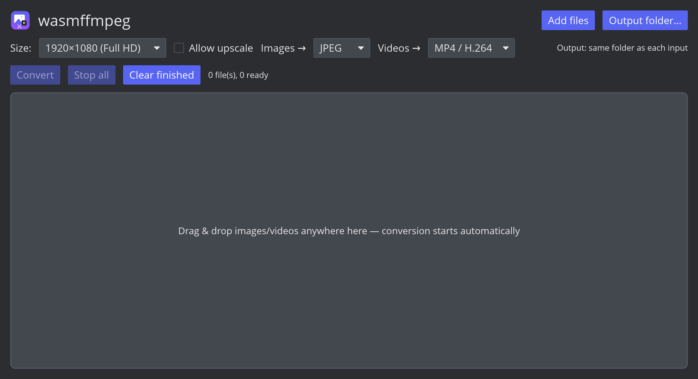

# wasmffmpeg

<p align="center">
  
</p>



Desktop media converter built with Rust, [iced](https://iced.rs) 0.14 and
FFmpeg. Converts and resizes images (JPEG, PNG, WebP, AVIF) and videos
(MP4 H.264/AV1, WebM VP9/AV1), one file or in bulk. Everything is scaled to
fit inside **1920×1080** (configurable) while preserving aspect ratio;
upscaling is off by default.

Drag & drop files anywhere onto the window (or use the file dialog) and
conversion starts immediately. Outputs land next to each input file — or in
your chosen folder — and are named
`RS-yyyy-MM-dd--HH-mm-ss-<first 7 chars of the original name>.<ext>`
(`RS` = resized), never overwriting anything. Output folder, default
formats, size preset and the upscale flag persist between restarts.

## Requirements

- Rust 1.98+ (`rustup`)
- FFmpeg 6+ on PATH: `sudo apt install ffmpeg`

## Run

```bash
cargo run -p wasmffmpeg-gui
```

## Build a release binary

```bash
cargo build --release -p wasmffmpeg-gui
# → target/release/wasmffmpeg-gui  (LTO-optimized, ~15 MB)
```

Prebuilt binaries for tagged versions are attached to
[GitHub Releases](https://github.com/shoutmarble/resize_image/releases).

## Test

```bash
cargo test --workspace
```

(Integration tests use the system ffmpeg and skip automatically when it is
not installed.)

## Layout

- `crates/core` — pure Rust conversion logic: media types, format catalog,
  aspect-ratio resize math, ffmpeg argument builder, progress parsing,
  output name generation. No I/O; compiles to `wasm32-unknown-unknown`
  (`cargo check -p wasmffmpeg-core --target wasm32-unknown-unknown`).
- `crates/gui` — iced 0.14 app plus the native backend that runs the
  system `ffmpeg`/`ffprobe` subprocesses.

## WebAssembly (phase 2)

The core is already wasm-safe. The browser version will reuse every
conversion command built by `wasmffmpeg-core` and execute them with
[ffmpeg.wasm](https://github.com/ffmpegwasm/ffmpeg.wasm)
(`@ffmpeg/ffmpeg` 0.12 + `@ffmpeg/core-mt`) through a small wasm-bindgen
JS glue layer, behind `cfg(target_arch = "wasm32")` in `crates/gui/src/backend/`.
Serving the multithreaded core requires COOP/COEP response headers.
